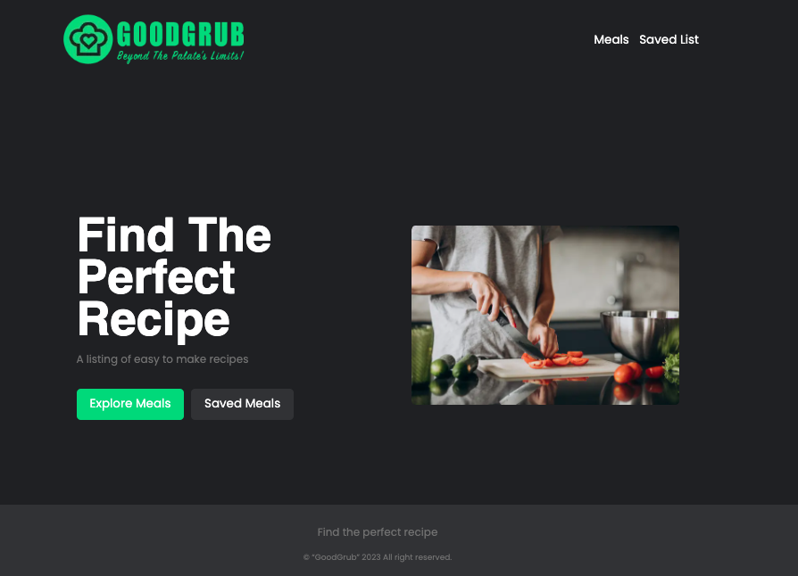

<!-- PROJECT SHIELDS -->
[![Contributors][contributors-shield]][contributors-url]
[![Issues][issues-shield]][issues-url]
[![MIT License][license-shield]][license-url]
[![LinkedIn][linkedin-shield]][linkedin-url]

<!-- PROJECT LOGO -->
<br />
<p align="center">
  
</p>
  <br />
  <br />

<!-- ABOUT THE PROJECT -->
## About The Project
  <br />
  <br />
  GoodGrub features a wide variety of recipes, from classic comfort foods
  to international dishes and healthy options. We make it easy to find the
  perfect recipe for any occasion, with options sorted by cuisine,
  ingredients, and dietary restrictions.
  <br />
  <br />
  We believe that cooking should be fun, easy, and accessible to everyone,
  which is why we&#39;re dedicated to providing the best recipe app on the
  market. So why wait? Download GoodGrub now and start cooking up a storm!
  <br />
  <br />
  

  <p align="right">(<a href="#readme-top">back to top</a>)</p>
  <br />
  <br />

## Built With

* [![Next][Next.js]][Next-url]
* [![React][React.js]][React-url]
* [![Axios][Axios]][Axios-url]
* [![Sass][Sass]][Sass-url]
* [![Jest][Jest]][Jest-url]

<p align="right">(<a href="#readme-top">back to top</a>)</p>
<br />
<br />

<!-- GETTING STARTED -->
## Getting Started

### Installation

1. Clone the repo:
   ```sh
   git clone https://github.com/your_username_/Project-Name.git
   ```
2. Install packages:
   ```sh
   yarn install
   ```
3. Run the development server:
   ```sh
   yarn dev
   ```

<p align="right">(<a href="#readme-top">back to top</a>)</p>
<br />

### Linter
  GoodGrub uses `ESlint` and `Prettier` to identify problematic patterns and clean up code.

1. To run the linters:
   ```sh
   yarn lint
   ```
2. To fix linting errors:
   ```sh
   yarn lint --fix
   ```

<p align="right">(<a href="#readme-top">back to top</a>)</p>
<br />

### Testing
  GoodGrub uses `Jest` and `React Testing Library` for testing purposes. Existing unit and snapshot tests can be found in `src` under the `__tests__` folder. 

1. To run tests:
   ```sh
   yarn test
   ```
2. Update snapshots:
   ```sh
   yarn test -u
   ```

<p align="right">(<a href="#readme-top">back to top</a>)</p>
<br />

<!-- CONTRIBUTING -->
## Contributing

Contributions are what make the open source community such an amazing place to be learn, inspire, and create. Any contributions you make are **greatly appreciated**.

1. Fork the Project
2. Create your Feature Branch (`git checkout -b feature/AmazingFeature`)
3. Commit your Changes (`git commit -m 'Add some AmazingFeature'`)
4. Push to the Branch (`git push origin feature/AmazingFeature`)
5. Open a Pull Request

<p align="right">(<a href="#readme-top">back to top</a>)</p>
<br />
<br />

<!-- LICENSE -->
## License

Distributed under the MIT License. See `LICENSE` for more information.

<p align="right">(<a href="#readme-top">back to top</a>)</p>
<br />
<br />

<!-- ACKNOWLEDGEMENTS -->
## Acknowledgements
  Big thanks to [TheMealDB](https://www.themealdb.com) for providing a free `API` that communicates with an awesome crowd-sourced database of Recipes from around the world!

  <p align="right">(<a href="#readme-top">back to top</a>)</p>


<!-- MARKDOWN LINKS & IMAGES -->
<!-- https://www.markdownguide.org/basic-syntax/#reference-style-links -->
[contributors-shield]: https://img.shields.io/github/contributors/chelseaharris137/goodgrub.svg?style=for-the-badge
[contributors-url]: https://github.com/chelseaharris137/goodgrub/graphs/contributors
[forks-shield]: https://img.shields.io/github/forks/chelseaharris137/goodgrub.svg?style=for-the-badge
[forks-url]: https://github.com/chelseaharris137/goodgrub/network/members
[stars-shield]: https://img.shields.io/github/stars/chelseaharris137/goodgrub.svg?style=for-the-badge
[stars-url]: https://github.com/chelseaharris137/goodgrub/stargazers
[issues-shield]: https://img.shields.io/github/issues/chelseaharris137/goodgrub.svg?style=for-the-badge
[issues-url]: https://github.com/chelseaharris137/goodgrub/issues
[license-shield]: https://img.shields.io/github/license/chelseaharris137/goodgrub.svg?style=for-the-badge
[license-url]: https://github.com/chelseaharris137/goodgrub/blob/master/LICENSE.txt
[linkedin-shield]: https://img.shields.io/badge/-LinkedIn-black.svg?style=for-the-badge&logo=linkedin&colorB=555
[linkedin-url]: https://www.linkedin.com/in/chelseaharris23/
[product-screenshot]: images/screenshot.png
[Next.js]: https://img.shields.io/badge/next.js-000000?style=for-the-badge&logo=nextdotjs&logoColor=white
[Next-url]: https://nextjs.org/
[React.js]: https://img.shields.io/badge/React-20232A?style=for-the-badge&logo=react&logoColor=61DAFB
[React-url]: https://reactjs.org/
[Axios]: https://img.shields.io/badge/Axios-35495E?style=for-the-badge&logo=axiosdotjs&logoColor=4FC08D
[Axios-url]: https://axios-http.com/
[Sass]: https://img.shields.io/badge/Sass-ff69b4?style=for-the-badge&logo=sass&logoColor=white
[Sass-url]: https://sass-lang.com/
[Jest]: https://img.shields.io/badge/Jest-4A4A55?style=for-the-badge&logo=jest&logoColor=FF3E00
[Jest-url]: https://jestjs.io/
